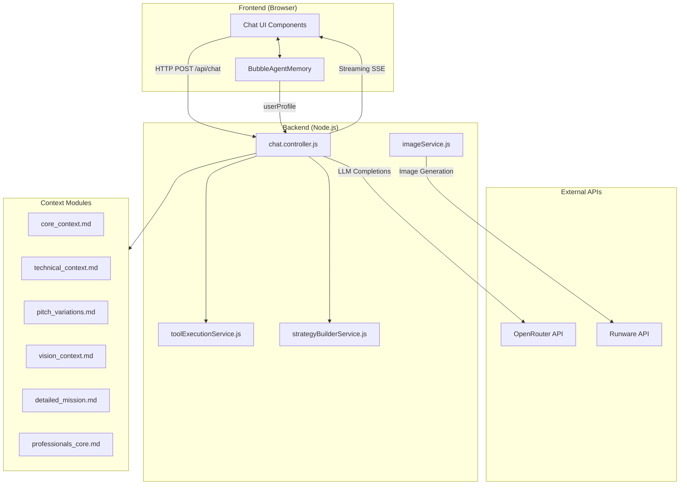
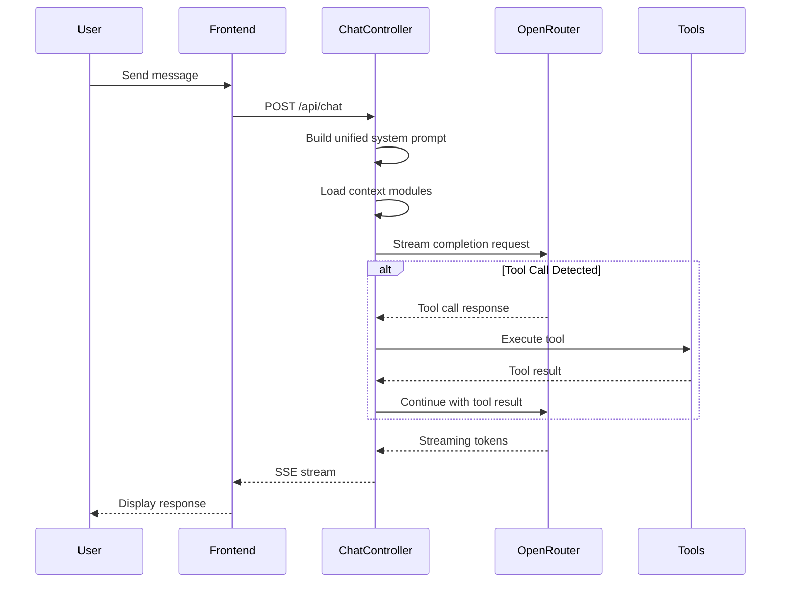
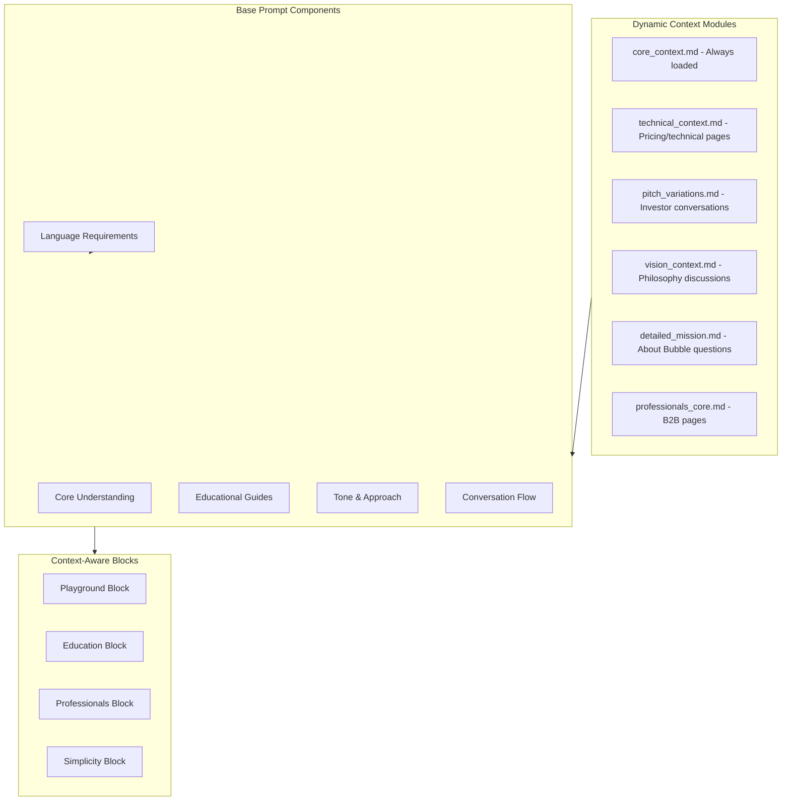
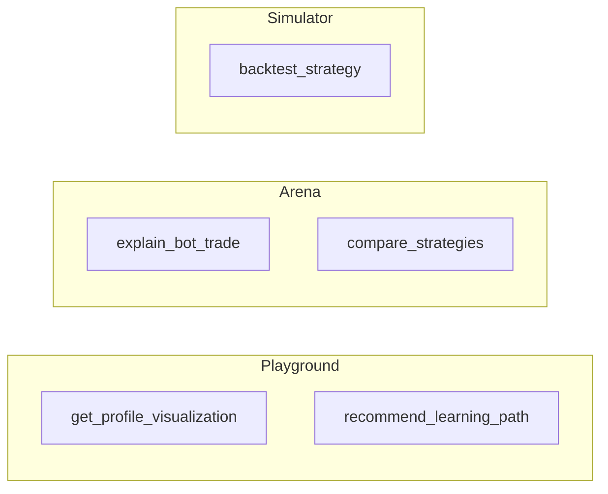
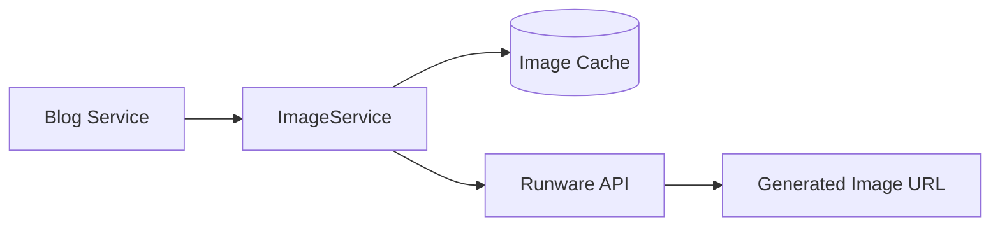
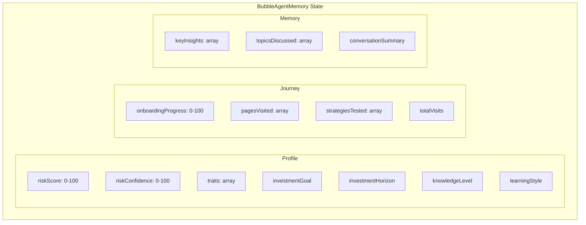

# LLM Agent Architecture - BubbleLaunch

This document maps out the AI/LLM agents used across the BubbleLaunch platform, including their prompts, inputs, outputs, and interactions.

---

## System Overview



---

## 1. Main Chatbot Agent

**Location**: `src/backend/controllers/chat.controller.js`

### Architecture Flow



### Input Parameters

| Parameter | Type | Description |
|-----------|------|-------------|
| `message` | string | User's chat message |
| `language` | string | `'fr'` or `'en'` |
| `pageContext` | string | Current page (index, pricing, playground, arena, simulator, professionals) |
| `conversationHistory` | array | Previous messages in conversation |
| `userProfile` | object | BubbleAgentMemory profile data |
| `isOnboarding` | boolean | Whether user is in onboarding flow |
| `onboardingStage` | string | Current onboarding stage |
| `waitlistShared` | boolean | Whether waitlist was already shared |

### Output

- **SSE Stream** with JSON events:
  - `{ content: string, text: string }` - Token chunks
  - `{ done: true }` - Stream complete
  - `{ typing: true }` - Typing indicator

### Model Configuration

The system uses **OpenRouter** with model rotation for cost optimization:

```javascript
const models = [
  "nvidia/nemotron-3-nano-30b-a3b:free",
  "xiaomi/mimo-v2-flash:free",
  "allenai/molmo-2-8b:free",
  "mistralai/devstral-2512:free",
  "tngtech/tng-r1t-chimera:free",
];
```

---

## 2. Unified System Prompt

The system prompt is dynamically constructed based on page context and user profile.

### Prompt Structure



### Page-Specific Behavior

| Page Context | Behavior | Special Features |
|--------------|----------|------------------|
| `index` | Mission-focused, discovery | Waitlist CTA |
| `pricing` | Value proposition, fee comparison | Technical context loaded |
| `playground` | Risk profile discovery, onboarding | Profile extraction protocol |
| `arena` | Bot explanations, trade analysis | `explain_bot_trade`, `compare_strategies` tools |
| `simulator` | Strategy building, backtesting | `backtest_strategy`, `compare_strategies` tools |
| `professionals` | B2B, formal tone ("vous") | Professionals context module |

### Onboarding Mode (Playground)

During onboarding, the LLM extracts profile data in a structured format:

**Extraction Format** (appended as HTML comment):
```html
<!-- PROFILE_UPDATE
{
  "riskScoreAdjustment": <-30 to +30>,
  "traits": ["trait1", "trait2"],
  "goalHint": "<string or null>",
  "horizonHint": "<short|medium|long|very_long or null>",
  "levelHint": "<beginner|intermediate|advanced or null>",
  "insight": "<one sentence insight>"
}
-->
```

**Scoring Guide**:
- Panic/fear → `-20 to -30`
- Cautious → `-10 to -15`
- Balanced → `0`
- Growth-oriented → `+10 to +15`
- Aggressive → `+20 to +30`

---

## 3. Context Modules

Located in `docs/company/`, loaded on-demand based on conversation triggers.

| Module | File | Trigger Keywords |
|--------|------|------------------|
| Core | `core_context.md` | Always loaded |
| Technical | `technical_context.md` | price, cost, fee, tarif, broker, api, technical |
| Pitch | `pitch_variations.md` | investor, pitch, business case, partenaire |
| Vision | `vision_context.md` | ethics, future, philosophy, mission, values |
| Detailed Mission | `detailed_mission.md` | why, pourquoi, mission, about bubble |
| Professionals | `professionals_core.md` | professionals page context |

---

## 4. LLM Tools

**Location**: `src/backend/services/toolExecutionService.js`

### Tool Distribution by Page



### Tool Specifications

#### `get_profile_visualization`

**Purpose**: Retrieve current investor profile with risk score and recommendations

**Input Schema**:
```json
{
  "include_recommendations": boolean
}
```

**Output**:
```json
{
  "profile": {
    "riskScore": 0-100,
    "riskConfidence": 0-100,
    "traits": ["patient", "analytical"],
    "goal": "retirement",
    "horizon": "long",
    "level": "intermediate"
  },
  "allocation": { "stocks": 60, "bonds": 35, "gold": 5 },
  "recommendations": [
    { "bot": "Fox", "strategy": "Risk Parity", "match": "best" }
  ]
}
```

---

#### `recommend_learning_path`

**Purpose**: Personalized learning sequence based on profile

**Input Schema**:
```json
{
  "focus_area": "fundamentals|strategies|risk_management|tools",
  "max_resources": integer (default 5, max 10)
}
```

**Output**:
```json
{
  "resources": [
    { "id": "guide-00", "title": "Comprendre les Placements", "level": "beginner", "topic": "fundamentals" }
  ],
  "nextSteps": ["Start with guides in order", "Test in Arena", "Build in Simulator"]
}
```

---

#### `explain_bot_trade`

**Purpose**: Explain why a bot made a trade at a specific timeline frame

**Input Schema**:
```json
{
  "bot_name": "Hedgehog|Fox|Hawk|Bear",
  "frame_index": integer (0-239),
  "level": "beginner|intermediate|advanced"
}
```

**Output**:
```json
{
  "bot": "Hawk",
  "date": "2020-03-15",
  "value": 125000,
  "pnl": -12.5,
  "event": { "type": "crash", "description": "COVID market crash" },
  "dialogue": { "text": "Market volatility spiking..." },
  "explanation": "At this point, Hawk lost 12.5%..."
}
```

---

#### `backtest_strategy`

**Purpose**: Execute backtest for user-defined portfolio allocation

**Input Schema**:
```json
{
  "strategy_name": "60/40",
  "allocation": { "SPY": 60, "IEF": 40, "GLD": 0 },
  "leverage": 1.0,
  "period_years": 1|3|5|10|20
}
```

**Output**:
```json
{
  "strategy_name": "60/40",
  "allocation": { "SPY": 60, "IEF": 40, "GLD": 0 },
  "metrics": {
    "totalReturn": 125.5,
    "annualizedReturn": 6.8,
    "volatility": 12.3,
    "sharpeRatio": 0.55,
    "maxDrawdown": -28.4
  },
  "chartData": [{ "date": "2005-01-01", "value": 100 }],
  "period": { "years": 20, "startDate": "2005-01-01", "endDate": "2025-01-01" }
}
```

---

#### `compare_strategies`

**Purpose**: Compare 2-3 bot strategies side-by-side

**Input Schema**:
```json
{
  "strategies": ["Hedgehog", "Fox", "Hawk"],
  "metrics": ["return", "volatility", "sharpe", "drawdown"]
}
```

**Output**:
```json
{
  "comparison": [
    { "strategy": "Hedgehog", "metrics": { "return": 4.2, "sharpe": 0.52 } },
    { "strategy": "Fox", "metrics": { "return": 6.8, "sharpe": 0.67 } }
  ],
  "winner": "Fox",
  "recommendation": "Fox offers the best risk-adjusted returns..."
}
```

---

## 5. Image Generation Service

**Location**: `src/backend/services/imageService.js`

### Architecture



### Configuration

| Setting | Value |
|---------|-------|
| Model | `runware:100@1` (Runware Flux Schnell) |
| Dimensions | 1152 × 704 |
| Cost | ~$0.0004/image |
| Format | PNG |

### Prompt Template

The image prompt is randomized for variety:

```
Create an abstract, tech-inspired illustration for a blog article cover.
Visuals:
- [Randomized composition: flowing shapes, gradients, overlays]
- Palette: [Random primary color], [Random secondary color], #667eea, white, deep gray
- Composition: smooth transitions, digital light effects, [Random flow direction]
- Vibe: innovative, digital, artistic, professional
- No text or logos
- Horizontal layout (1152x704)
```

**Randomization Elements**:
- Color focuses: cool blue, cyan, soft purple, white, deep gray
- Flow directions: upward, downward, horizontal, spiraling, cascading
- Compositions: flowing shapes, light effects, geometric overlays

---

## 6. Frontend Memory (BubbleAgentMemory)

**Location**: `src/frontend/js/bubble-agent-memory.js`

### State Structure



### Key Methods

| Method | Purpose |
|--------|---------|
| `adjustRiskScore(delta, weight)` | Incrementally adjust risk score |
| `addTrait(trait)` | Add personality trait |
| `applyProfileUpdate(update)` | Apply LLM-extracted profile update |
| `getContextForLLM()` | Get token-efficient context for API |
| `isOnboardingCompleted()` | Check onboarding status |
| `getRecommendedAllocation()` | Map risk score to allocation |

### Profile Name Mapping

| Risk Score | Profile Name |
|------------|--------------|
| 0-19 | Très Prudent |
| 20-39 | Prudent |
| 40-59 | Équilibré |
| 60-79 | Dynamique |
| 80-100 | Offensif |

---

## 7. Strategy Builder Service

**Location**: `src/backend/services/strategyBuilderService.js`

### Purpose

Lightweight heuristic-based intent detection for strategy suggestions (no LLM call required).

### Keyword Detection

| Intent | Keywords |
|--------|----------|
| safe | safe, defensive, conservative, low risk, protect, stable |
| growth | growth, aggressive, high return, maximize, performance |
| balanced | balanced, moderate, middle, mix, blend |
| momentum | momentum, trend, follow, chase |
| diversified | diversified, spread, all weather, dalio |

### Strategy Suggestions

| ID | Label (FR) | Mix | Use Case |
|----|------------|-----|----------|
| defensive_rp | Parité Défensive | SPY 35%, IEF 45%, GLD 20% | Low volatility |
| balanced_rp_momo | RP + Momentum | SPY 55%, IEF 30%, GLD 15% | Balance with trend |
| aggressive_momo | Momentum Dynamique | SPY 70%, IEF 20%, GLD 10% | High performance |
| all_weather | All-Weather inspiré | SPY 30%, IEF 40%, GLD 20%, CASH 10% | Broad diversification |

---

## Summary

The BubbleLaunch platform uses a **unified conversational AI architecture** with:

1. **Single chatbot** (`chat.controller.js`) adapting to page context
2. **Dynamic context modules** loaded based on conversation topics
3. **5 specialized tools** for profile, learning, trade explanations, and backtesting
4. **Frontend state management** (`BubbleAgentMemory`) for personalization
5. **Image generation** via Runware for blog articles
6. **Heuristic strategy builder** for quick suggestions without LLM calls

All LLM interactions go through **OpenRouter** with free model rotation for cost efficiency.
